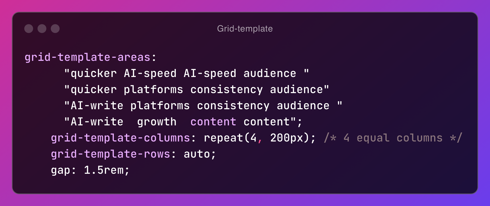

# Front End Mentorship - Bento Grid Solution

This is Brielle's solution to the [Bento grid challenge on Frontend Mentor](https://www.frontendmentor.io/challenges/bento-grid-RMydElrlOj).

## Table of contents

-  [Overview](#overview)
   -  [Screenshot](#screenshot)
   -  [Links](#links)
-  [My process](#my-process)
   -  [Built with](#built-with)
   -  [What I learned](#what-i-learned)
   -  [Useful resources](#useful-resources)
-  [Author](#author)
-  [Acknowledgments](#acknowledgments)

## Overview

### Screenshot

### Links

-  Solution URL: [Add solution URL here](https://your-solution-url.com) - github
-  Live Site URL: [Add live site URL here](https://your-live-site-url.com) - vercel

## My process

### Built with

I used the following to get this project done:

-  HTML5
-  CSS3
-  Flexbox
-  CSS Grid
-  Mobile-first design

### What I learned

This project helped me get a deeper understanding of the grid-template-areas property.

### Useful resources

-  [Coding in public](https://www.youtube.com/live/qvb2JRDecoA?si=6CqZdWQHJvgSX16c) - This helped me implement the grid template areas. I really like how it was explained.
-  [w3Schools](https://www.example.com) - w3school is always a good reference site to refresh previously learnt concepts

## Author

-  Frontend Mentor - [@Bri-elle](https://www.frontendmentor.io/profile/Bri-elle)

## Acknowledgments

Chris Pennington of Coding in Public on youtube
